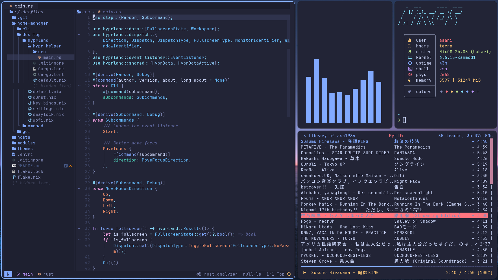

# dotfiles

asa1984's NixOS & home-manager configurations

| Category | Name           | Description                           |
| -------- | -------------- | ------------------------------------- |
| OS       | NixOS          | **_The Best Linux Distro_**           |
| Kernel   | XanMod         | How to pronounce?                     |
| Shell    | zsh + Starship | Simple & Stylish                      |
| Editor   | Neovim         | Pursuing developer experience         |
| Terminal | WezTerm        | Practical terminal emulator           |
| WM       | Hyprland       | Beautiful animation & Nix integration |



## 🏗️ File Structure

### `hosts`

Per-host settings (e.g. hardware configurations)

- `terra`: My primary desktop PC
- `rhodes`: My laptop (HP Envy13)
- `rhine`: VM on the Proxmox VE server

### `modules`

Shared NixOS modules

- `core`: Commonly used settings
- `desktop`: For desktop environments
- `programs`: Optional programs

### `home-manager`

- `cli`: CLI tools
- `gui`: GUI applications
- `desktop`: Desktop environments & Utilities

### `pkgs`

Personal packages

- Noto Sans CJK JP (Non-variable font)
  - For some software that does not support variable fonts (e.g. Steam)

### `themes`

The color schemes for all applications

- **tokyonight-moon**: Refer to [folke/tokyonight.nvim](https://github.com/folke/tokyonight.nvim)

## 🚀 Setup

### Requirements

- Nix command & Flakes are enabled

### Commands

#### NixOS

```nix
nix develop
nh os switch .
reboot
```

#### home-manager

```nix
nix develop
nh home switch .
```

## 📖 References

- [nixypanda/dotfiles](https://github.com/nixypanda/dotfiles)
- [fufexan/dotfiles](https://github.com/fufexan/dotfiles)
- [Misterio77/nix-config](https://github.com/Misterio77/nix-config)
- [ryan4yin/nix-config](https://github.com/ryan4yin/nix-config)
- [natsukium/dotfiles](https://github.com/natsukium/dotfiles)
